# QA E-commerce Automation


Projeto completo de automação de testes combinando **API + UI**, com execução em **CI/CD (GitHub Actions)** e geração de relatórios com **Allure Report**.

---

## Tecnologias utilizadas

* Python 3.12
* Pytest
* Playwright
* Requests
* Faker
* Allure Report
* GitHub Actions (CI/CD)

---

## Relatório de Testes

Acesse o relatório online:

https://guilhermedalbuquerque.github.io/qa-ecommerce-full/

---

## Estrutura do Projeto

```
qa-ecommerce-full/
│
├── tests/
│   ├── api/
│   ├── ui/
│
├── pages/
│   └── login_page.py
│
├── utils/
│   └── data_generator.py
│
├── docs/
│   └── images/
│
├── conftest.py
├── requirements.txt
└── pytest.ini
```

---

## Conceitos aplicados

* Page Object Model (POM)
* Fixtures do Pytest
* Geração de dados dinâmicos
* Testes positivos e negativos
* Integração contínua (CI)
* Variáveis de ambiente (.env)
* Execução headless (CI)

---

## Variáveis de ambiente

Crie um arquivo `.env`:

```
API_KEY=your_api_key_here
```

---

## Como rodar o projeto

```
pip install -r requirements.txt
playwright install
pytest --alluredir=allure-results
allure serve allure-results
```

---

# Testes de API

### Criar usuário

* Valida status 201
* Valida retorno do payload


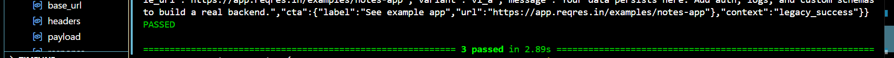
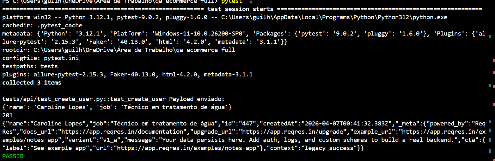

---

### Atualizar usuário

* Valida status 200
* Confere alteração dos dados


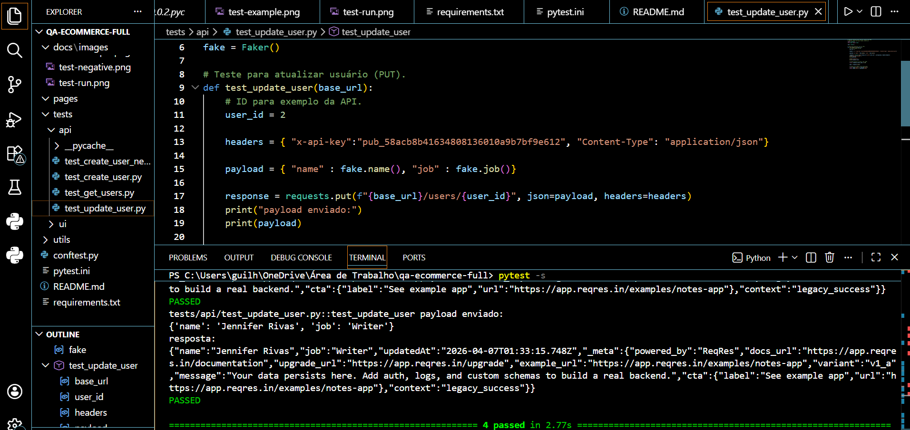

---

### Deletar usuário

* Valida status 204


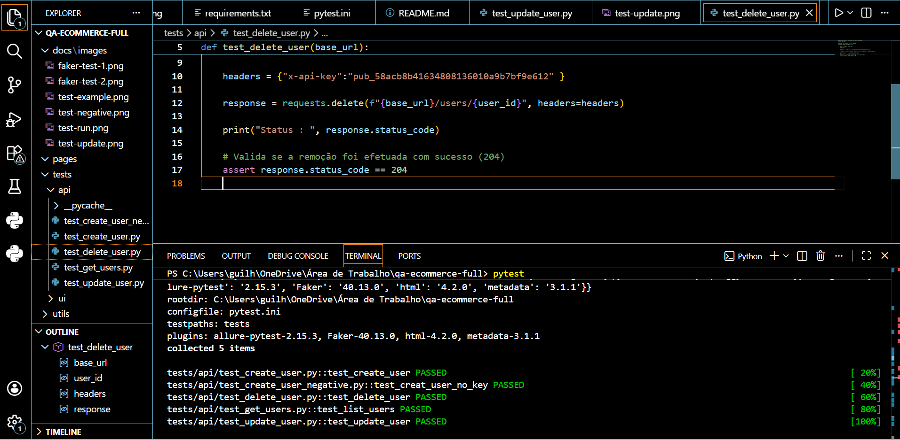
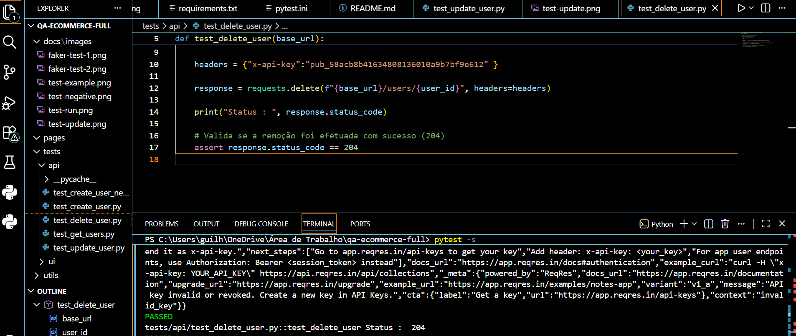

---

### Listar usuários

* Valida status 200
* Confere retorno da lista


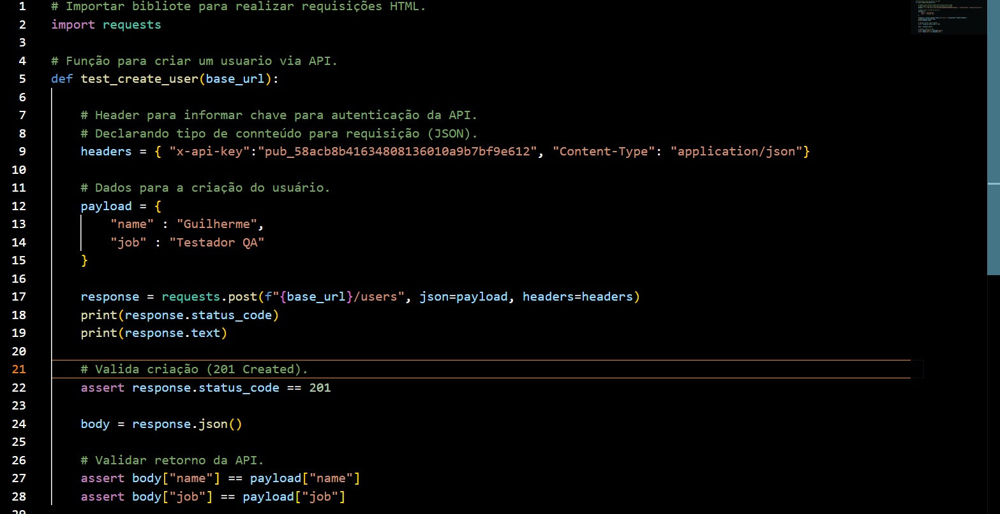

---

### Criar usuário sem API Key

* Teste negativo
* Espera status 401


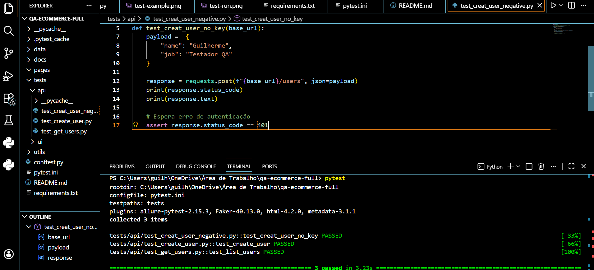

---

### Execução dos testes API


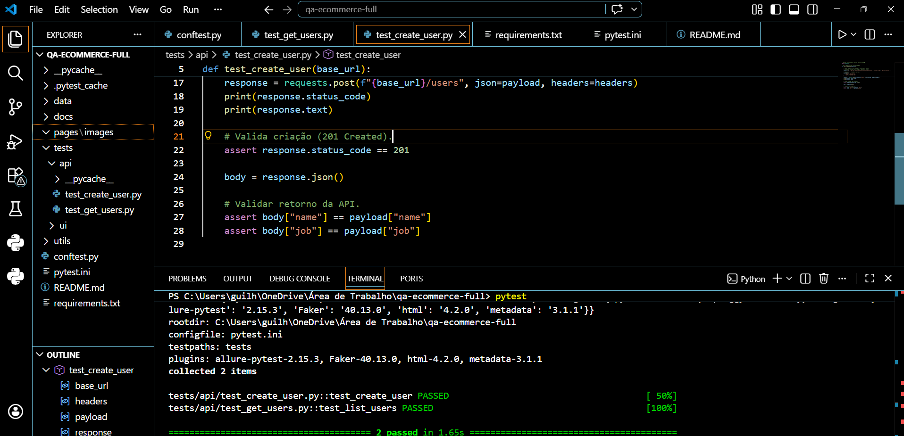

---

# Testes de UI

Aplicação testada:
    https://www.saucedemo.com/

---

### Login com sucesso

* Preenche usuário e senha
* Valida redirecionamento

📸

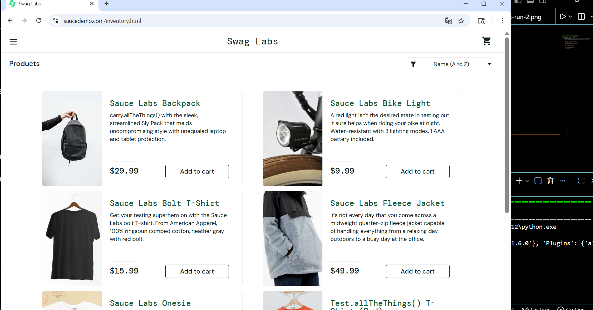
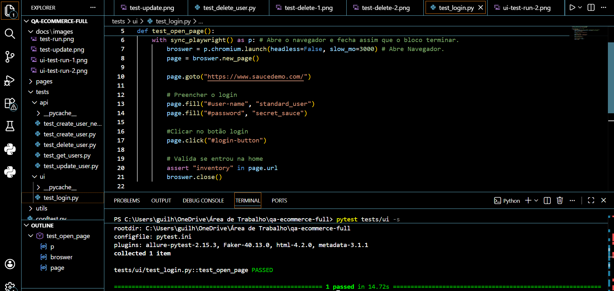

---

### Login inválido

* Valida mensagem de erro

📸

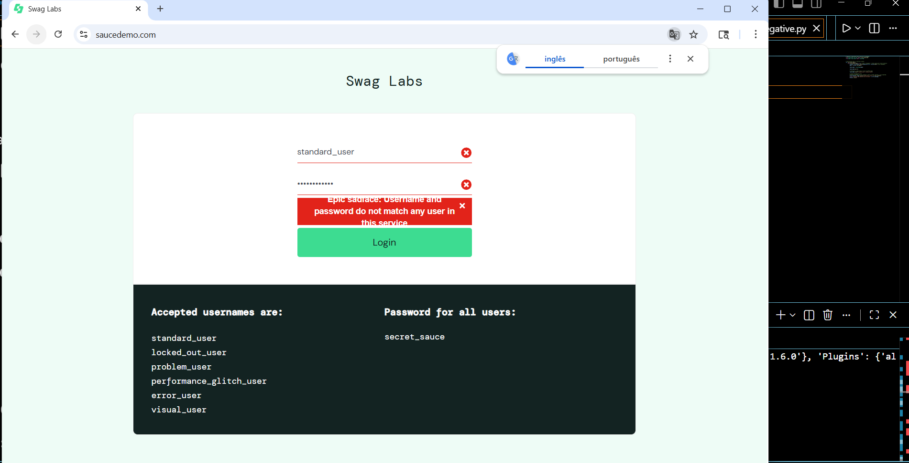
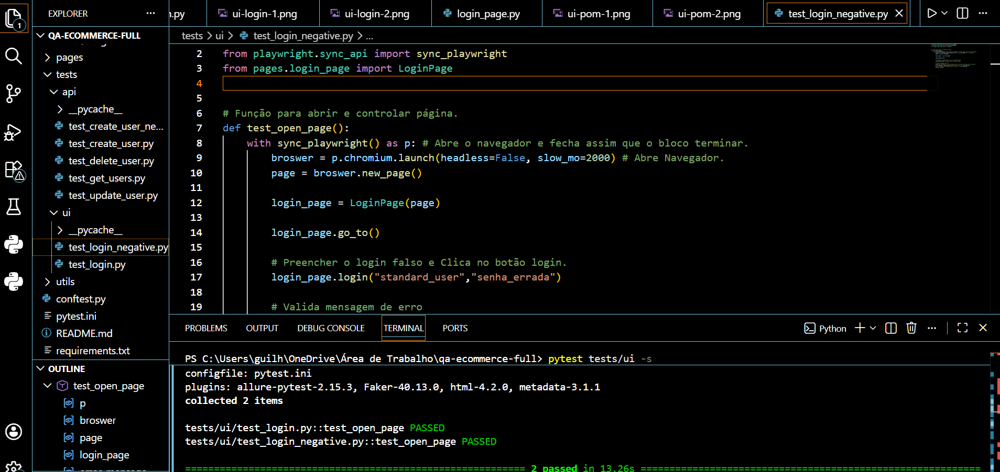

---

### Page Object Model (POM)

Classe responsável por centralizar ações da página:

```
class LoginPage:
    def __init__(self, page):
        self.page = page

    def go_to(self):
        self.page.goto("https://www.saucedemo.com/")

    def login(self, username, password):
        self.page.fill("#user-name", username)
        self.page.fill("#password", password)
        self.page.click("#login-button")
```


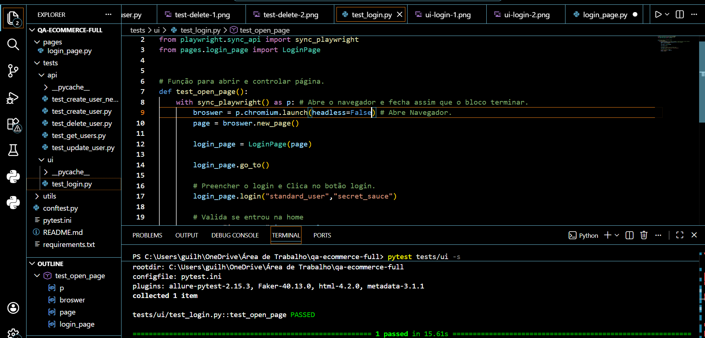
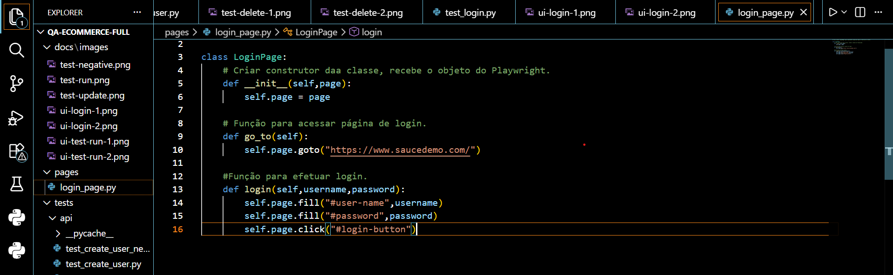

---

### Execução dos testes UI

📸

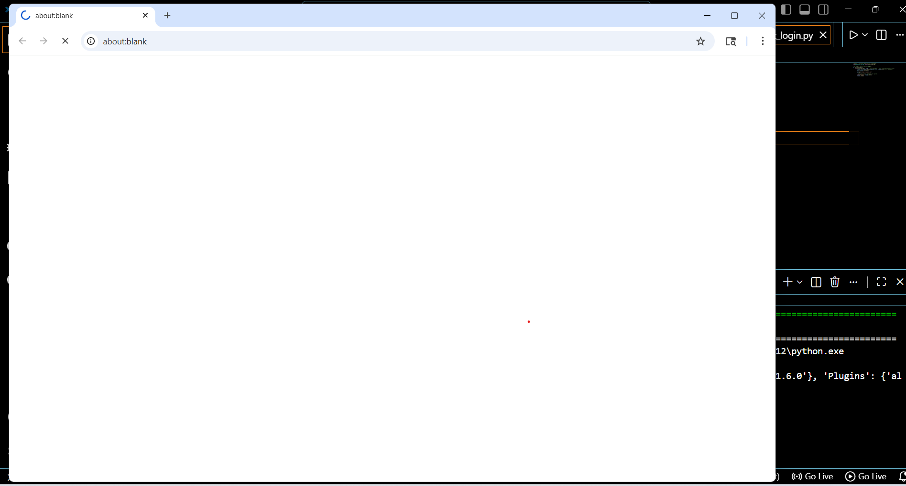
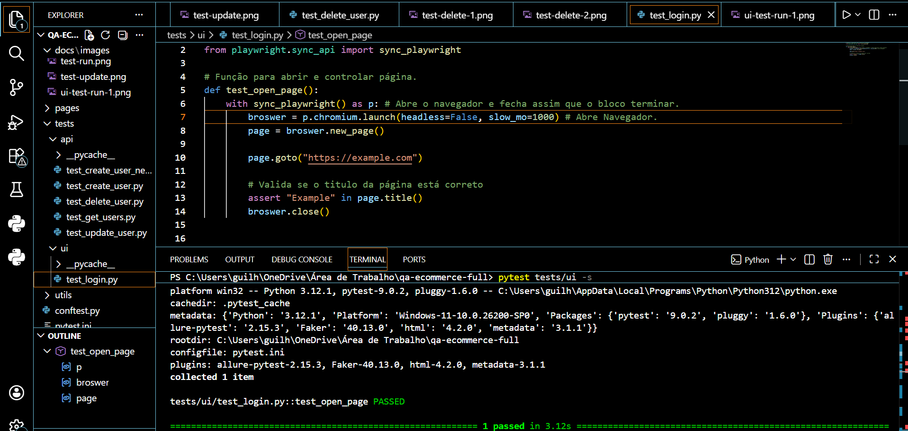

---

# CI/CD com GitHub Actions

Pipeline automatizado que:

* Instala dependências
* Executa testes
* Gera relatório Allure
* Publica no GitHub Pages

---

## Disparado em:

* Push
* Pull Request

---

## Exemplo do Workflow

```
- name: Rodar testes com Allure
  run: pytest --alluredir=allure-results
```

---

# Diferenciais do projeto

✔ Integração API + UI
✔ Uso de Faker (dados dinâmicos)
✔ Segurança com `.env`
✔ Execução headless no CI
✔ Relatório Allure automatizado
✔ Deploy com GitHub Pages

---

#  Autor

Guilherme de Albuquerque Silva Azevedo

---

#  Observações

Projeto desenvolvido com foco em simular um ambiente real de automação de testes, incluindo validações completas de API e interface, boas práticas de organização e integração contínua.
